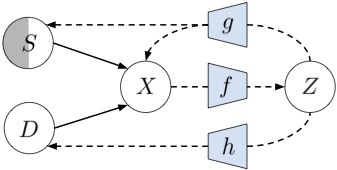

# Removing Inter-Experimental Variability from Functional Data in Systems Neuroscience 

This repository is the official implementation of [https://www.biorxiv.org/content/10.1101/2021.10.29.466492v2.full.pdf+html]. 



## Getting started

### Disclaimer: Work in progress
We're working on turning the code in this repository into the pip-installable RAVE-toolbox for removing inter-experimental variability from experiments. For the moment being, you can use it to reproduce the figures from our paper by following the instructions below.
1. ```git clone``` the repository onto your machine
2. Have a look at the packages listed in the requirements file; make sure to remove already installed packages from the list, or to specify specific package versions in case you need them for other projects you're working on. 
3. From within the directory containing the ```requirements.txt``` file, run ```pip install -r requirements.txt```

## Downloading the necessary files
You can download the data we worked with from here: [link pending]
In order to reproduce the figures from the paper, you need the following data files:
- Recordings from bipolar cells: Datasets/bio/...
- simulated bipolar cell responses: Datasets/silico/...
- IPL info files: Datasets/ipl/...
- 
## Reproducing figures from the paper 

To get started, we suggest running the demo notebook for the simulated data, which loads or trains a model with tuned hyperparameters, runs the evaluation functions and creates the corresponding plots.
The notebook can be found here: ```notebooks/Evaluate_sim_data.ipynb```
You need to adjust the file paths in the corresponding section of the notebook to reflect the locations of the downloaded files.
